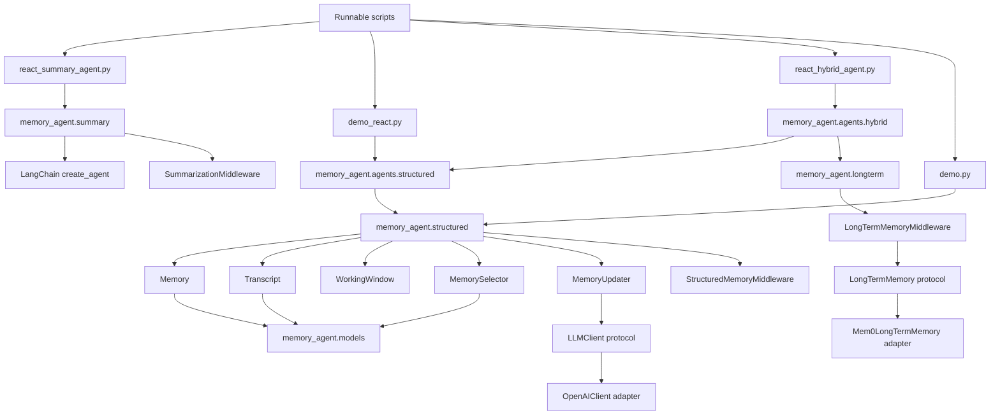
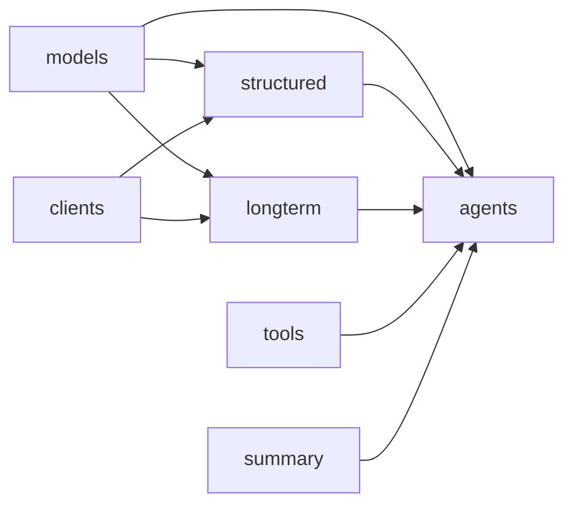
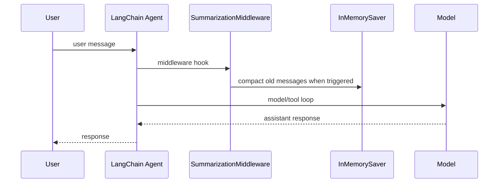
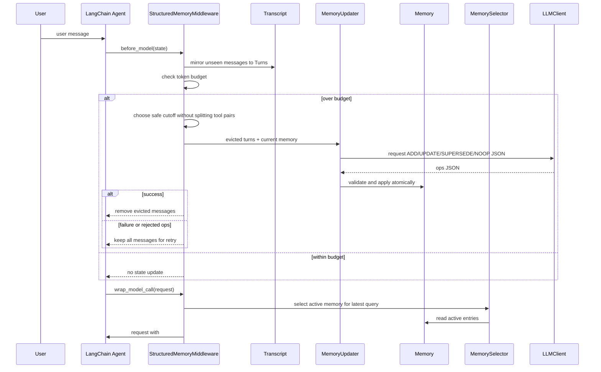
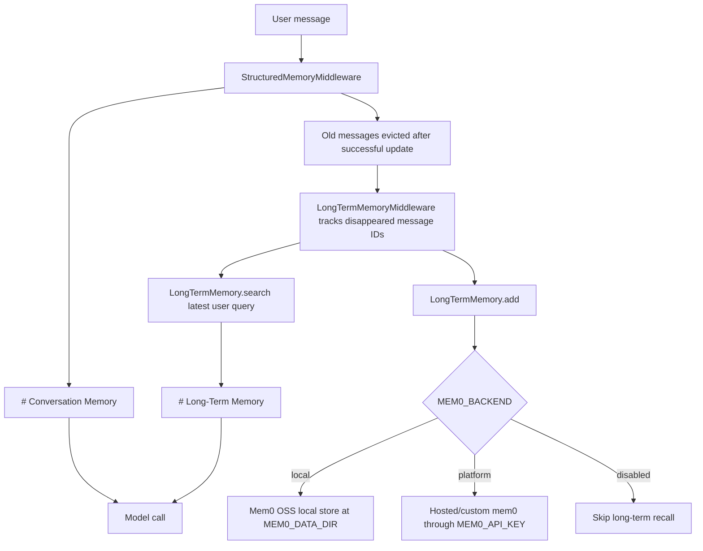
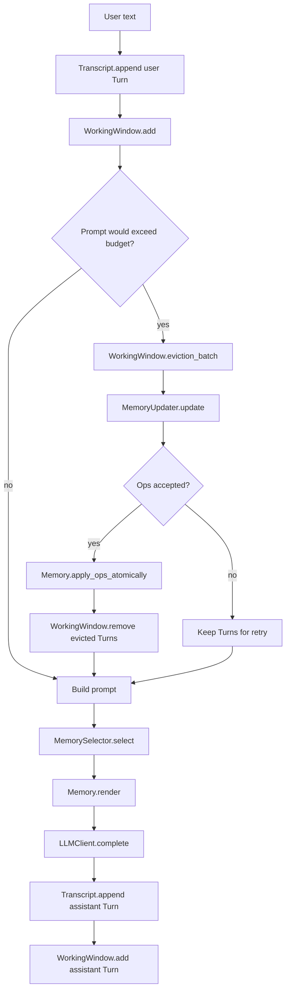
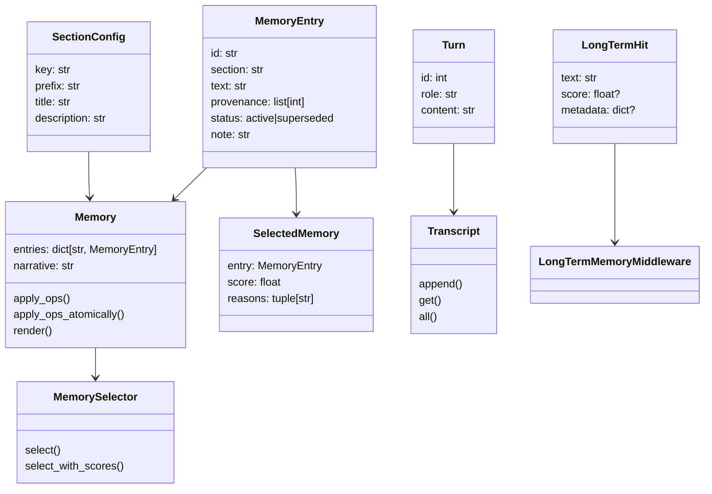
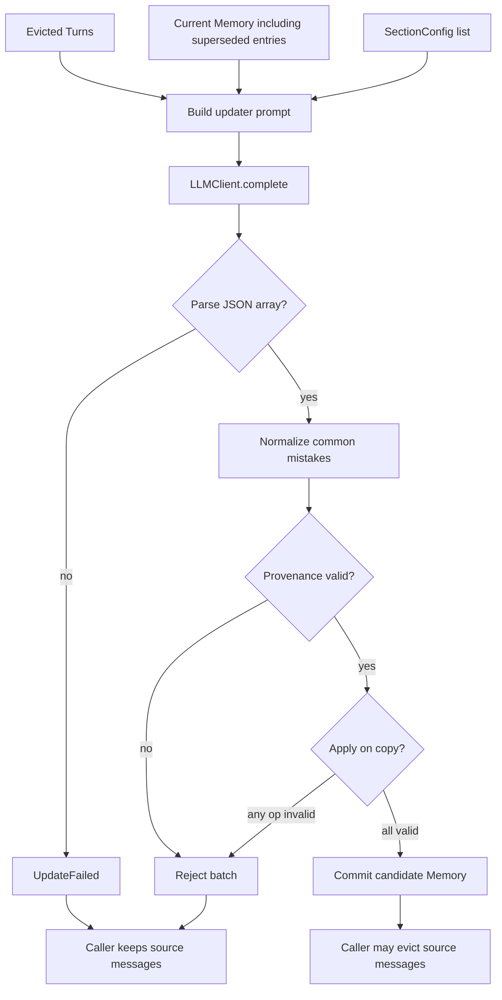
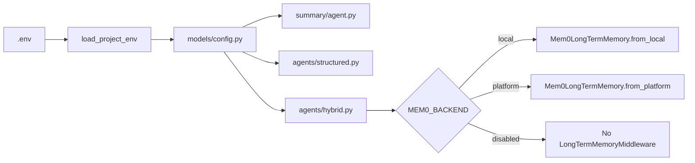
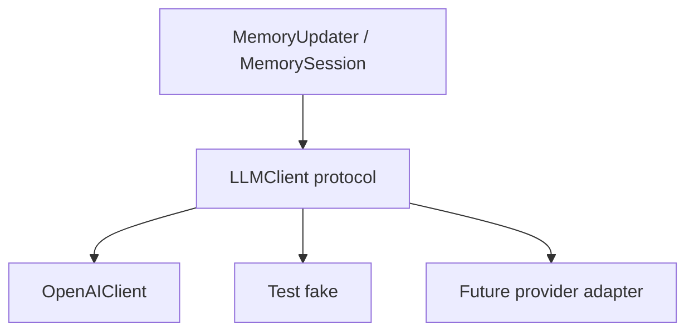

# MemoryAgent Architecture

This repo follows two practical rules:

- Put importable package code in clear packages with explicit responsibility.
  This follows the direction of the Python Packaging User Guide's package
  layout guidance: import packages should be obvious and separated from repo
  tooling/files.
- Treat LangChain middleware as composable context-management units. LangChain
  documents middleware as the mechanism for prompt/context transformation,
  retries, guardrails, and other agent-loop hooks, so summary, structured
  memory, and long-term recall should be separate middleware concerns.

References:

- Python Packaging User Guide: https://packaging.python.org/en/latest/discussions/src-layout-vs-flat-layout/
- LangChain middleware overview: https://docs.langchain.com/oss/python/langchain/middleware
- LangChain agents/context management: https://docs.langchain.com/oss/python/langchain/agents

## Package Map

```text
memory_agent/
  summary/       SummaryMiddleware baseline only.
  structured/    Operation-based memory domain and runtime.
  longterm/      Long-term vector recall integration.
  agents/        Agent assembly for runnable demos.
  clients/       External service protocols/adapters.
  models/        Dataclasses, config models, constants.
  tools/         Demo tools.
```

The key distinction:

```text
summary/
  Uses LangChain SummarizationMiddleware.
  It is a baseline compression strategy.
  It does not produce structured memory entries.

structured/
  Owns Memory, Transcript, WorkingWindow, MemorySelector, MemoryUpdater,
  MemorySession, and StructuredMemoryMiddleware.
  It is not summary code. It stores auditable entries through operations.

longterm/
  Owns LongTermMemoryMiddleware.
  It integrates long-term recall with the agent loop.
  The concrete mem0 adapter lives in clients/mem0.py.
```

## High-Level Component Graph



## Dependency Direction



Rules:

- `models/` has no LangChain, mem0, or OpenAI imports.
- `clients/` is where external services are adapted behind small protocols.
- `structured/` owns structured-memory behavior and may depend on
  `LLMClient`, but not on a concrete OpenAI import except through injection.
- `longterm/` owns LangChain long-term recall middleware; concrete mem0 details
  stay in `clients/mem0.py`.
- `summary/` owns only the LangChain built-in summary baseline.
- `agents/` wires these pieces together for runnable apps.

## Runtime Path 1: Summary Baseline

Entry point: `react_summary_agent.py`

Code location:

```text
memory_agent/summary/agent.py
```



This is the only summary-specific package. If you are looking for summary
behavior, start at `memory_agent.summary`.

## Runtime Path 2: Structured Memory With LangChain

Entry point: `demo_react.py`

Code locations:

```text
memory_agent/agents/structured.py
memory_agent/structured/middleware.py
memory_agent/structured/updater.py
memory_agent/structured/memory.py
```



This path is not summary-based. It converts evicted turns into addressable
memory entries and preserves superseded state.

## Runtime Path 3: Structured Memory + Long-Term mem0

Entry point: `react_hybrid_agent.py`

Code locations:

```text
memory_agent/agents/hybrid.py
memory_agent/longterm/middleware.py
memory_agent/clients/mem0.py
```



`# Conversation Memory` is current structured state. `# Long-Term Memory` is
supporting recall from older stored content.

## Runtime Path 4: Framework-Free Structured Session

Entry point: `demo.py`

Code locations:

```text
memory_agent/structured/session.py
memory_agent/structured/window.py
memory_agent/structured/transcript.py
```



## Data Model Relationships



## Memory Update Contract



Supported operations:

- `ADD`: create a new active entry.
- `UPDATE`: refine an active entry that remains true.
- `SUPERSEDE`: mark an active entry inactive when contradicted.
- `NOOP`: save nothing from the batch.

The Python layer validates shape, IDs, sections, and provenance. The LLM still
owns the semantic choice.

Memory quality policy:

- Entries should be atomic and concise.
- Exact dates, versions, counts, durations, percentages, latencies, endpoints,
  table/column names, file names, error messages, library names, and deployment
  targets should be preserved in `exact_values` when they may matter later.
- Generic assistant advice and example code should not become memory unless the
  user accepts, decides, implements, observes, or reports it.
- `open_questions` is only for unresolved blockers or decisions that remain
  important after the turn. Ordinary one-off help requests should usually be
  `NOOP` or become concise `facts`/`progress` only when they contain durable
  state.
- `status_changes` captures contradictions, corrections, reversals, denials,
  and latest-vs-previous truths. This section is intentionally rendered before
  generic facts so contradiction-resolution questions can see it.
- `timeline` captures ordered milestones and event sequences. This section is
  intentionally rendered before generic facts/open questions so chronology
  questions can see it.

BEAM answering uses question-specific structured-memory selection before
building the answer context. This prevents generic facts and open questions
from crowding out status-change or timeline entries that are relevant to a
specific probing question.

## Configuration Flow



Important mem0 settings:

```text
MEM0_BACKEND=local
  Uses MEM0_DATA_DIR, default .mem0.
  Good for local testing and repeatable demos.

MEM0_BACKEND=platform
  Uses MEM0_API_KEY and MEM0_USER_ID.
  Does not require or use MEM0_DATA_DIR.
  Use this for your own hosted/custom mem0 content.

MEM0_BACKEND=disabled
  Skips long-term vector memory.
  Structured in-session memory still runs.
```

`build_hybrid_agent(..., long_term_memory=...)` accepts an injected
`LongTermMemory` implementation for tests or custom adapters.

## LLM Boundary



`LLMClient` exists so core code can depend on a tiny behavior contract. It is
why tests can use deterministic fakes without importing LangChain OpenAI.
`OpenAIClient` is the production adapter that satisfies that protocol.
