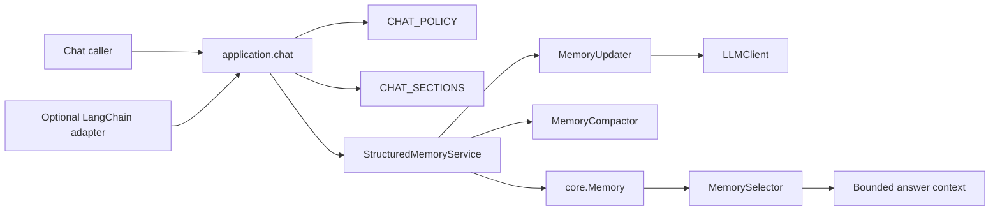
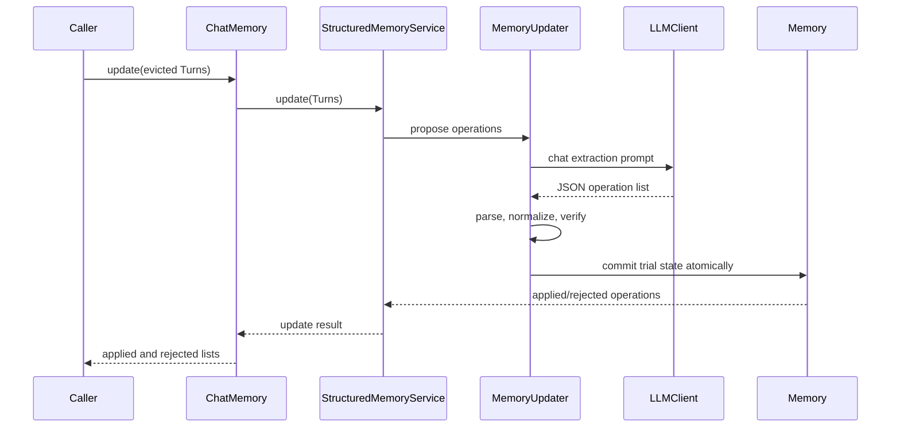
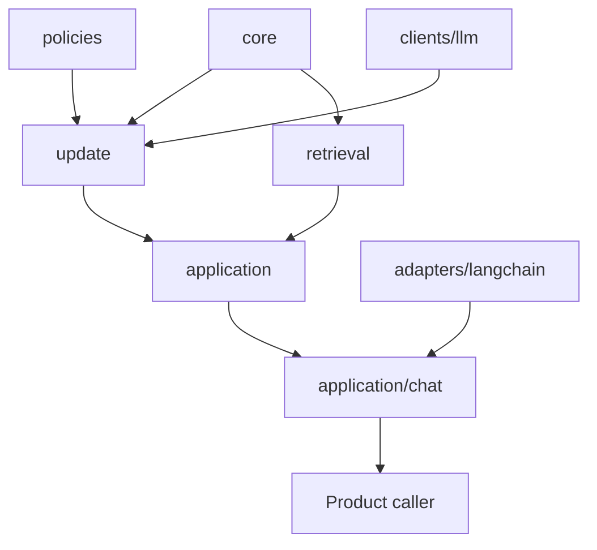

# MemoryAgent architecture

MemoryAgent has one supported production workload: chat memory. The runtime
is framework-neutral and bounded by a single policy (`CHAT_POLICY`) and one
section schema (`CHAT_SECTIONS`). Optional integrations adapt to this public
surface; they do not add production profiles, storage engines, or section
presets.

## Package map

```text
memory_agent/
  core/
    models.py             memory entries, values, and identities
    sections.py           SectionConfig and CHAT_SECTIONS
    store.py              in-memory state and atomic operation commits
    transcript.py         immutable conversation turns
    transcript_store.py   transcript collection
    window.py             token-bounded working window
  policies/
    structured.py         CHAT_POLICY and section validation
  normalization/
    chat.py               chat subject/value normalization
  update/
    operations.py         operation parsing and structural validation
    prompts.py            chat extraction prompts
    updater.py            proposal, verification, and atomic commit pipeline
    compactor.py          bounded active-entry compaction
    selector.py           update candidate selection
    verifier.py           post-update invariants
  retrieval/
    selector.py           bounded active-entry selection
    context.py            bounded prompt context rendering
    quality.py             diagnostics
  application/
    chat.py               canonical build_chat_memory facade
    session.py            framework-free send loop
    structured_service.py update/verify/commit orchestration
  clients/
    llm.py                small LLM protocol and provider adapter
  adapters/langchain/
    chat.py               optional framework adapter
```

The application facade imports only core runtime components. It never imports
optional frameworks, external memory services, scripts, or evaluation code.
The optional LangChain adapter is a one-way boundary: it turns framework
messages into `Turn` values and delegates memory operations to the same core.

## Component graph



## Chat update flow



`ADD`, `UPDATE`, `SUPERSEDE`, and `NOOP` are the only supported operation
kinds. Provenance must point to supplied turns. A rejected or failed update
does not discard source turns, allowing the caller to retry. Retrieval selects
active entries within a caller-supplied token budget and renders a bounded
`# Conversation Memory` block.

## Policy and schema

`CHAT_POLICY` is the sole production policy. It uses durable chat retention,
allows a bounded operation batch, and rejects non-chat inventories such as
exact-value, timeline, and tool-observation sections. `CHAT_SECTIONS` contains:

```text
decisions, preferences, status_changes, goal,
facts, progress, open_questions, failed_attempts
```

There is no profile registry, preset resolver, or compatibility alias that can
silently widen retention. Product configuration controls model and token
limits only; it cannot select another policy or section list.

## Dependency boundaries



- `core` has no LLM, provider, or framework imports.
- `update` depends on the `LLMClient` protocol, not a provider implementation.
- `retrieval` only reads active core state and enforces token budgets.
- `application/chat` is the public import boundary.
- Optional adapters depend on the public facade; the facade never imports
  them back.
- `demos/`, scripts, and test utilities are outside the installable runtime.

## Verification

Run the complete suite with:

```bash
python -m pytest -q
```

`tests/test_architecture_boundaries.py` checks the one-policy/one-schema
contract, removed module paths, optional-dependency isolation, and core import
direction. `tests/test_chat_facade.py` verifies that importing and using the
public facade does not load optional integration modules.
